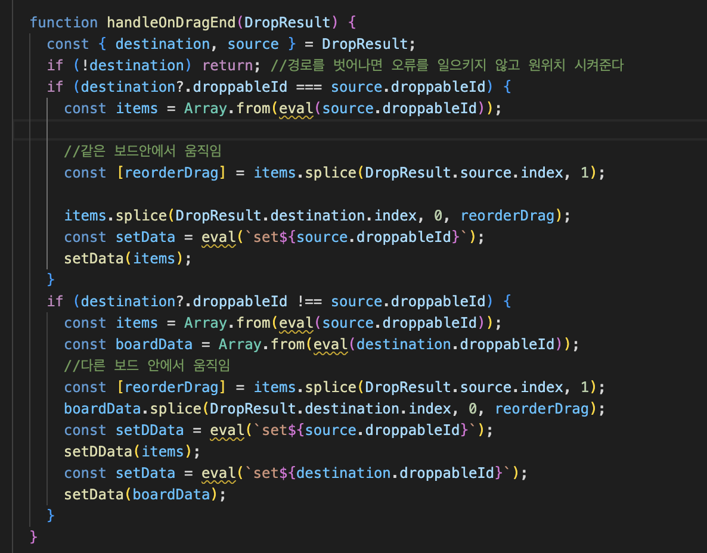
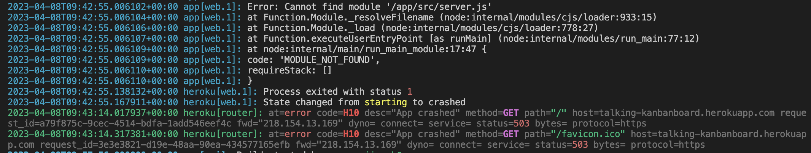

# kanban-board

> P가 J가 되는 칸반보드  
> **URL** https://talking-kanbanboard.herokuapp.com/

## 1.참여인원

개인프로젝트

<br/>

## 2.사용한 기술

- **스택**  
  React / JavaScript(ES6) / SCSS

- **기타 라이브러리 및 협업 툴**  
  주요 라이브러리: react-beautiful-dnd / axios / web speech api  
  배포: heroku

<br/>

## 3.핵심 기능

- 글 내용 작성 후 버튼 클릭 시 todo에 카드생성

- 음성 이모지를 누른 후 음성인식을 통해 글 내용이 자동생성

- 카드 삭제 기능

- 개인의 우선순위에 따라 카드 드레그 가능

- todo, inprogress,complete 카드 간에 자유롭게 이동 가능

  <br/>

## 4.트러블 슈팅

#### 📌CRUD

개인프로젝트를 하면서 가장 와닿은게 "개발은 협업이 중요하다"이다. 물론 풀스택 개발자라면 말이 다를 수 있겠지만 프론트만 알고 있는 나로서는 프로젝트를 진행하면서 백엔드 팀원의 부재를 크게 느끼게 되었다.
node.js를 배운적이 없기 때문에 간단히 백엔드 서버를 구축할 수 있는 json-server 라이브러리를 활용하였다.
문제는 여기서부터 시작되었다.
간소하게 작동하는 백엔드였기 때문에 json객체를 입맛대로 수정할 수 없었다.

가장 이상적인 json은 아래와 같이 작성한 것이다

```json
{
  "boards": [
    {
      "id": 0,
      "title": "todo",
      "tasks": [
        {
          "id": 0,
          "content": "javascript"
        },
        {
          "id": 1,
          "content": "python"
        }
      ]
    },
    {
      "id": 1,
      "title": "in_progress",
      "tasks": [
        {
          "id": 0,
          "content": "pizza"
        }
      ]
    }
  ]
}
```

하지만 2중배열로 구성된 URL 수정해서 axios로 받아올 수 없어서 아쉽게도 각각 데이터를 받아오는 방식으로 변경하였다.

```jsx
const getCard = () => {
  axios
    .all([
      axios.get('https://talking-kanbanboard.herokuapp.com/todos'),
      axios.get(`https://talking-kanbanboard.herokuapp.com/inProgress`),
      axios.get(`https://talking-kanbanboard.herokuapp.com/completed`),
    ])
    .then(
      axios.spread((res1, res2, res3) => {
        const data1 = res1.data;
        const data2 = res2.data;
        const data3 = res3.data;
        const res = [...data1, ...data2, ...data3];
        settodos(data1);
        setinProgress(data2);
        setcomplete(data3);
        setcomment(res);
      })
    );
};
```

todo,inprogress,complete 3개의 보드들이 독립적으로 데이터를 가져야 했기 때문에 각각의 데이터를 보여주는 것에는 성공했지만

아쉬운점으로 하나의 state로 관리하였으면 컴포넌트로 만들 수 있는 부분들도 중복코드로 나열하게 되었다.

<br/>

#### 📌 드레그 앤 드롭

기능을 위해서 `react-beautiful-dnd`라는 라이브러리를 사용했다. 라이브러리를 사용하면 한층 쉬워진다는 생각과는 달리 라이브러리를 배우는 것이 만만하지 않았다.

가장 어려운 부분이 같은 보드안에서 이동과 다른 보드 간의 이동을 만들어내는 부분였다.

데이터를 각각의 state로 만들었기 때문에 이동하면서 바뀐 state와 id위치에 넣어주는 작업이 필요했다.

URL로 받아온 데이터의 키값을 얻지 못해서 string타입을 변수로 변환시키는 작업이 필요로 했다

시작 state에서 도착한 state로 데이터를 옮겨주기 위해 eval()함수를 사용해서 stirng값을 변수로 바꿔서 넣어주었다

<details>
<summary>코드보기</summary>
  <br>
</details>

<br/>

#### 📌 heroku 배포

간단하게 배포가 가능한 netlify로 배포를 시도하였다.
문제는 netlify는 정적 사이트만 배포가 가능해서 json-server를 사용한 kanban app이 정상적으로 동작하지 않았다.  
그래서 Heroku로 다시 배포를 진행하였다.  
백엔드작업을 node server파일을 만들어서 진행하였는데 이때 많은 에러를 직면하게 되었다.  
 <br>
위와 같은 에러가 계속해서 나타났고 아래와 같은 다양한 시도를 하였다.  
 **시도 1 :** package.json scripts에 heroku-postbuild를 추가한다. (실패)  
 **시도 2 :** 환경변수와 빌드팩의 문제라고 생각해서 heroku에서 환경변수를 세팅하고 `heroku buildpacks:set mars/create-react-app`
빌드팩을 추가한다. (실패)  
 **시도 3 :** package.json 에 engines를 추가해서 npm과 node의 버전을 명시한다. (실패)  
 **시도 4 :** 최종으로 알게된 원인은 `"description": "json-server"`가 install 되지 않았던 것이다.

에러를 해결하고 느낀것은 에러를 해결하고 싶으면 "에러 원인을 잘 읽어라"이다.  
 빨갛게 나타는 h10에러에 집중해서 에러 로그를 제대로 확인하지 못했다.  
 위에 'module not found'를 조금만 더 상세히 봤어도 더 빨리 해결했을거라 생각한다.

<br/>

> 개선해야하는 부분!
>
> PUT기능을 완성하지 못했기 때문에 새로고침을 하게 되면 데이터가 원래의 위치로 돌아가게 되고
>
> 다른 보드로 옮긴 후 delete버튼을 누르게 되면 카드의 id와 state가 달라져 오류를 일으킨다

<br/>

## 5.회고

처음 프로젝트를 구상했을때는 한 페이지에서 동작하는 단순한 프로젝트라서 금방 해낼 수 있지 않을까? 너무 쉬운 프로젝트를 선정했나? 라는      
근자감으로 시작하였다.

트러블슈팅에서도 작성했듯이 프론트 개발자는 절실히 백엔드 개발자가 필요했다.

CRUD가 가능한 프로젝트를 구상했기 때문에 백엔드를 모르는 것은 큰 난항이 되었고 결국 CRUD에서 PUT을 완성하지 못한채 프로젝트를 끝맺게 되었다.

첫 개인 프로젝트가 다 그렇겠지만 뿌듯함 보다는 미완성으로 끝냈다는 아쉬움이 더 크게 남았다.

미완이지만 완에 가까운 프로젝트를 위해 코드를 수없이 고치고 그 과정에서 배우고 익혔기 때문에 개인의 성장 측면에서는 큰 의미가 있다고 생각한다.

후에 더 배운 개발자가 된다면 완성으로 마침표를 꼭 찍고싶다.
